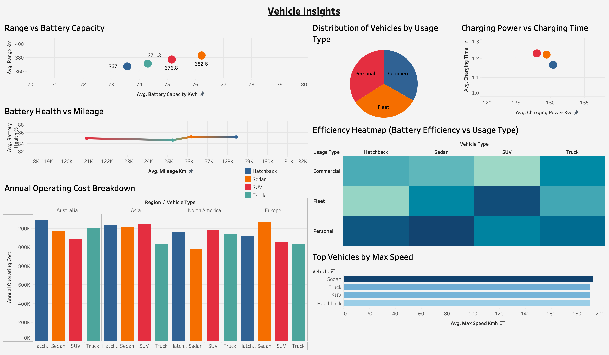
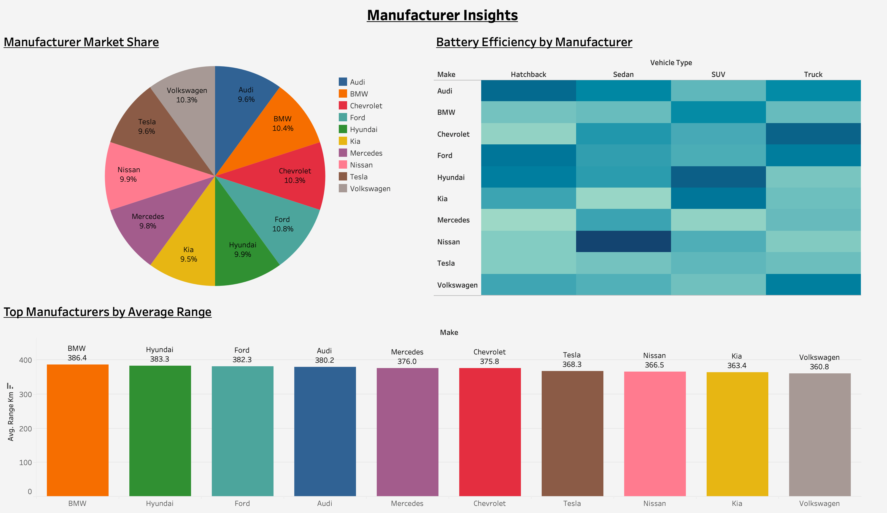

# EV Insights Dashboard

🚗🔋 **EV Insights Dashboard** built using **Tableau** to analyze Electric Vehicle (EV) data and uncover trends in range, battery capacity, efficiency, vehicle types, and manufacturer performance.

---

## 🔍 Dashboard Overview

This interactive dashboard provides insights into EV trends, including:

- **EV Range Analysis**: Average range by year, model, and body type  
- **Battery Metrics**: Capacity & efficiency metrics  
- **Vehicle Type Distribution**: Explore different EV types in the dataset  
- **Manufacturer Insights**: Market share, efficiency heatmap, and average range  
- **Interactive Filters**: Filter by Year, Make, and Vehicle Type  
- **UI Design**: Clean and optimized for business users  

---

## 🛠 Tools Used

- **Tableau**: Dashboard creation and interactivity  
- **Python**: Data cleaning and EDA (Pandas, Seaborn, Matplotlib)  
- **Dataset**: CSV file (cleaned and processed)  

---

## 📊 Key Insights

- SUVs dominate the dataset, but sedans generally show higher efficiency  
- Manufacturers show clear differences in average range and battery performance  
- Battery capacity strongly correlates with vehicle range (positive trend)  

---

## 🌐 Live Dashboard

- **GitHub Repository**: [EV Insights Dashboard](https://github.com/PrateekKumarH/EV-Insights-Dashboard)  
- **Tableau Public Dashboard**: [View Dashboard](https://public.tableau.com/app/profile/prateek.kumar4029/viz/EVInsightsDashboard/VehicleDashboard)  

---

## 🙌 Purpose & Learning

This project was created to sharpen hands-on **data analysis** and **visualization** skills, and to turn data into actionable insights.  

Skills practiced include:

- Data cleaning and preprocessing  
- Feature engineering  
- Visualization best practices  
- Creating dashboards for real-world business use  

---

## 🗾 Dashboard Preview

### 1

### 2

---

## 📌 Hashtags / Topics

#DataDrivenInsights  
#TableauAnalytics  
#EVDataVisualization  
#ElectricVehicleInsights  
#DashboardDesign  
#AnalyticsForEVs  
#BusinessIntelligence  
#DataVisualizationTools  
#tableau  
#dataviz  
#python  
#analyticsprojects  

---

## 🤝 Feedback & Contributions

I welcome **feedback, suggestions, and contributions**. Feel free to open an issue or submit a pull request.

---

## 🧑‍💻 Author
**Prateek Kumar**  
📧 h.prateekumar@gmail.com  
📅 Created: 10th December 2025

---

## 📄 License
This project is shared for educational and demonstration purposes.
